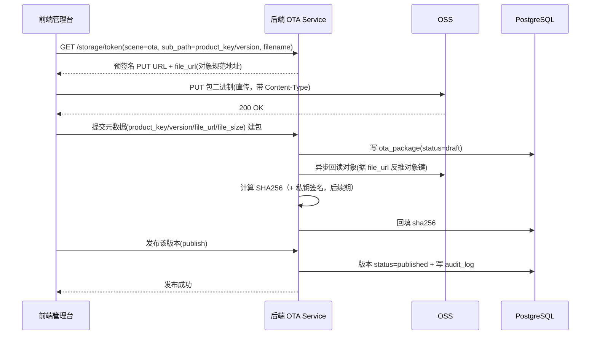
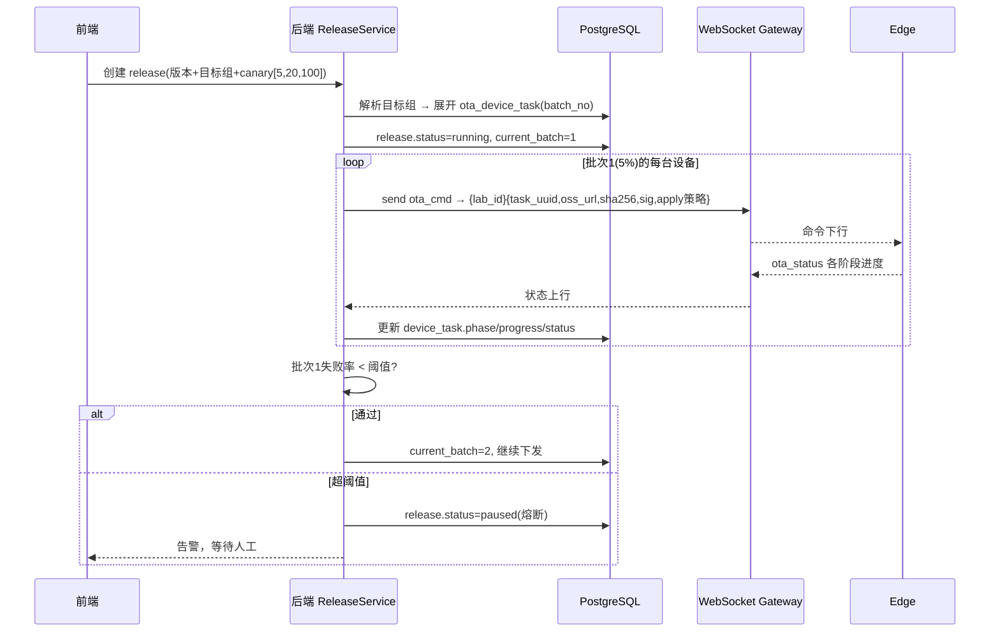
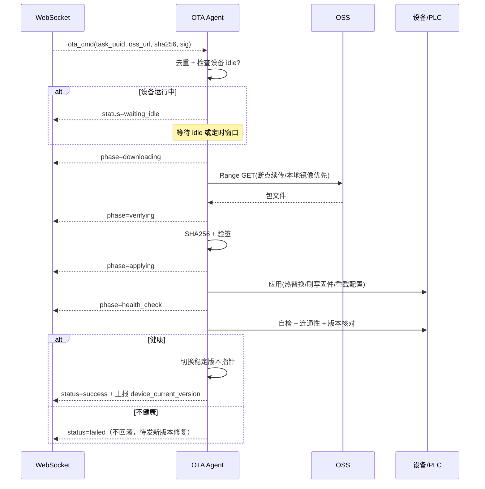
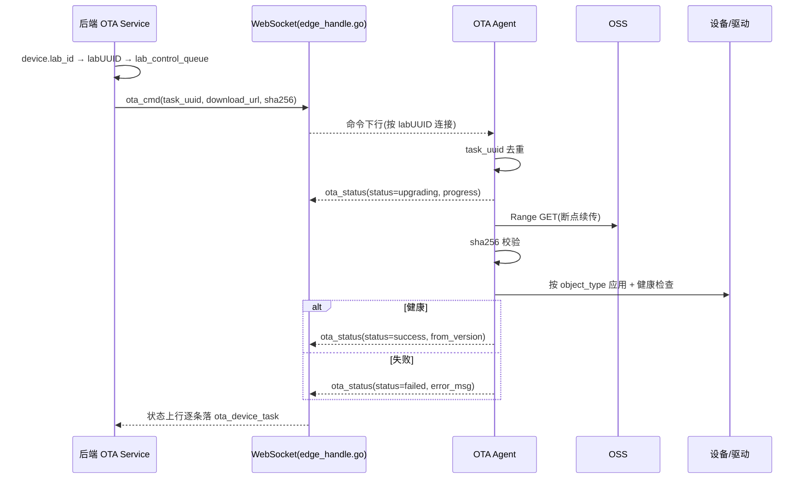

# 设备 OTA 管理模块 — 技术设计

**Status:** Draft 2026-07-05（rev：前端经预签名 URL 直传 OSS + 移除 `oss_key`）
**Owners:** tangshaodong
**Related:** `product_designs/exception_handling/`、`product_designs/Equipment/`、`product_designs/mobile_IOT_and_multiplatform/`

> 全链路架构：前端（Uni-Lab-Cloud）→ 后端（uni-lab-backend, Go）→ Edge/OS（Uni-Lab-OS, Python）→ 设备/PLC（下位机）。
> OTA 模块负责把**升级包**安全、可控、从云端分发并应用到 Edge 与设备侧。

---

## 目录

- [1. 背景与目标](#1-背景与目标)
- [2. 关键决策](#2-关键决策已拍板)
- [3. 升级对象与范围](#3-升级对象与范围)
- [4. 系统架构](#4-系统架构)
- [5. 云端需要实现的能力](#5-云端需要实现的能力)
- [6. Edge 侧需要实现的能力](#6-edge-侧需要实现的能力)
- [7. 数据模型（表结构）](#7-数据模型表结构)
- [8. 状态机](#8-状态机)
- [9. 时序图](#9-时序图)
- [10. 安全与权限](#10-安全与权限)
- [11. 分期规划](#11-分期规划)
- [12. 最小闭环](#12-最小闭环)
- [13. Edge 侧 OTA 协议](#13-edge-侧-ota-协议)

---

## 1. 背景与目标

Uni-Lab 部署在大量实验室的边缘主机（工控机）上，每台 Edge 主机运行 Uni-Lab-OS，并通过驱动控制多类设备与 PLC 下位机。存在以下痛点：

- **不可控**：无法知道每台设备当前跑的是哪个版本、升级是否成功。
- **不安全**：无签名校验，升级失败可能导致设备瘫痪、实验中断。
- **不可批量**：无法按实验室 / 设备组灰度发布，一次升级全量风险高。
- **无审计**：谁在什么时间升级了什么，无记录。

**目标**：建设一套端到端的 OTA 管理体系，实现：

1. **统一包管理**：云端集中托管 Edge 程序、设备驱动、PLC/MCU 固件、配置等升级包，带版本与签名。
2. **可控发布**：支持灰度 / 分批 / 全量，按设备定向下发，支持定时窗口。
3. **安全可靠**：下载断点续传、SHA256 + 签名校验。
4. **全程可观测**：每台设备每个升级阶段的进度、结果实时上报与聚合。
5. **可审计**：完整记录发布、下发、执行全链路。

> **不做回滚**：升级若失败，按「向前修复」处理——发布并下发一个新版本，而不是回滚到旧版本。

---

## 2. 关键决策（已拍板）

| # | 决策 |
|---|---|
| D1 | OTA 升级对象抽象为统一的 `ota_package`（带 `object_type` 区分 edge/driver/firmware/config），云端为唯一可信源（SOT）。 |
| D2 | 包二进制存 OSS，**前端经预签名 PUT URL 直传、后端不代传文件**；DB 只存元数据 + 下载地址（`file_url`）+ 校验和 + 签名。上传经 `/storage/token` 换取预签名 URL，下载走 OSS，均不经后端转发。 |
| D3 | 下发通道复用现有 **WebSocket**（命令下行 + 状态上行，与现有 app_bridges 一致），大文件走 OSS HTTP，不走 WebSocket。 |
| D4 | 发布与执行解耦：`ota_release`（一次发布意图 + 策略）→ 展开成多条 `ota_device_task`（每设备一条执行记录）。 |
| D5 | **不做回滚**：升级失败不回滚旧版本，由运维发布新版本「向前修复」。 |
| D6 | 设备升级必须在**安全态**进行：设备必须处于 idle（无运行中实验），否则任务进入 `waiting_idle`，不强制打断。 |
| D7 | 灰度按批次百分比；批次间设熔断阈值，失败率超阈值自动暂停后续批次。 |
| D8 | 同一 Edge / 设备同时只允许一个进行中的 OTA 任务（DB 唯一约束 + Edge 本地锁）。 |
| D9 | PLC/MCU 固件升级由 Edge 的 OTA agent 经 Modbus/串口/厂商协议代理写入，云端不直连下位机。 |
| D10 | 权限走 OPA：发布、审批、强制升级为独立权限点。 |
---

## 3. 升级对象与范围

`ota_package.object_type` 枚举：

| object_type | 说明 | 应用方式 |
|---|---|---|
| `edge_agent` | Uni-Lab-OS 主程序 / Python 虚拟环境 | 解压到新版本目录，切换 symlink，重启服务 |
| `device_driver` | 设备驱动包（`unilabos/devices/*`） | 热替换驱动模块，重载设备 |
| `config` | graph.yaml / controller config / registry | 替换配置文件，重载 |
| `firmware` | PLC / 下位机固件 | Edge 经 Modbus / 串口 / CAN 刷写（云端已透传，Edge applier 后续实现） |

> 当前阶段固件类（`firmware`）的 Edge applier 暂缓，不在落地范围内。`object_type` 对云端只是透传字段，将来 Edge 侧补对应 applier 时云端零改动。

每个 `object_type` 对应一套 **applier 策略**（见 §6）。

---

## 4. 系统架构

```
┌─────────────────────────── 云端 (uni-lab-backend, Go) ───────────────────────────┐
│  前端 Uni-Lab-Cloud                                                                │
│    └─ OTA 管理台：包上传 / 版本管理 / 发布策略 / 监控大盘                          │
│         ↓ REST                                                                      │
│  OTA Service (pkg/repo + pkg/service)                                               │
│    ├─ 包管理 PackageService    ├─ 发布编排 ReleaseService                           │
│    ├─ 任务调度 TaskScheduler   ├─ 状态聚合 ProgressAggregator                       │
│    └─ 审计 AuditService                                                             │
│         ↓ 元数据/签名          ↓ 命令下行 (WebSocket)   ↑ 状态上行 (WebSocket)        │
│   PostgreSQL          OSS(包二进制)    WebSocket Gateway                              │
└────────────────────────────────────────────────┬───────────────────────────────────┘
                                                  │ WebSocket(命令/状态)  +  HTTPS(OSS下载)
┌─────────────────────────────── Edge (Uni-Lab-OS, Python) ────────────────────────┐
│  OTA Agent (常驻进程)                                                              │
│    ├─ TaskReceiver(WebSocket长连接) ├─ Downloader(断点续传/限速/本地镜像)           │
│    ├─ Verifier(SHA256+签名)     ├─ Applier(按 object_type)                          │
│    ├─ HealthChecker             └─ Reporter(阶段进度上报)                           │
│         ↓ 驱动热加载 / 配置重载        ↓ Modbus/串口/CAN 刷写固件                   │
│  设备驱动层 ───────────────────────────→ 设备 / PLC 下位机                          │
└──────────────────────────────────────────────────────────────────────────────────┘
```

**通道职责**：

- **WebSocket**：Edge 与后端维持长连接，命令下行（`ota_cmd`）与状态上行（`ota_status`）走该连接，小消息、低延迟、断线重连后edge通过短连接口拉取一次。
- **OSS HTTPS**：升级包大文件下载，预签名 URL 限时有效，支持 Range 断点续传(后续做)。
- **实验室本地镜像（可选）**：同一实验室指定一台 Edge 作 mirror，其余 Edge 从本地拉取，省外网带宽。

---

## 5. 云端需要实现的能力

### 5.1 包管理（Package Management）
- 升级包上传：**前端向 `/storage/token` 换取预签名 PUT URL → 直传 OSS → 提交元数据（`file_url` / `file_size`）建包**，后端不代传二进制，落 `ota_package`（包与版本合一）。
- `sha256` 由后端**异步回读对象计算并回填**（据 `file_url` 反推对象键后经 OSS SDK 读取）；用平台私钥对包做**数字签名**（`signature`），Edge 用公钥验签。
- 包元数据：`object_type`、目标设备型号 / 驱动名、`min_compatible_*`（最低兼容版本，防止跨大版本直升）、变更日志、依赖。
- 版本语义化（semver）+ 不可变（已发布版本禁止覆盖，只能发新版本）。

### 5.2 版本与兼容性
- 版本列表、变更日志。
- **兼容性矩阵**：driver 版本 ↔ edge_agent 版本 ↔ firmware 版本，下发前做依赖检查，不兼容直接拒绝。

### 5.3 设备定向与版本清单
- 创建 release 时通过 `device_filter` 圈选目标（全部设备，或指定设备清单），无需独立的分组表。
- 维护每台 Edge / 设备的**当前版本清单**（`device_current_version`），支持"哪些设备落后于最新版"查询。

### 5.4 发布编排（Release Orchestration）
- 创建 `ota_release`：选包版本 + 目标设备（`device_filter`：全部 / 指定设备清单）+ 策略（即时 / 定时窗口 / 灰度分批）。
- **灰度分批**：按百分比分批（如 5% → 20% → 100%），每批设熔断阈值，失败率超阈值自动暂停。
- 审批流（可选）：高风险对象（firmware）需二次审批。
- 展开为多条 `ota_device_task`，交给调度器。

### 5.5 任务调度与下发
- TaskScheduler 控制并发与节奏，经 WebSocket 向目标 Edge 下发命令（含 OSS 预签名 URL、sha256、签名、apply 策略）。
- 重试：Edge 无响应 / 失败按策略重试，超次数标记 `failed`。
- 幂等：命令带 `task_uuid`，Edge 去重。

### 5.6 进度监控与聚合
- 接收 WebSocket 上行的 `ota_status` 消息，逐阶段更新 `ota_device_task.phase` 与进度。
- 大盘：按 release 聚合（pending / downloading / applying / success / failed 计数），实时进度条。
- 异常联动：失败事件接入 `exception_handling` 体系。

### 5.7 审计
- `ota_audit_log` 记录发布 / 审批 / 下发 / 强制升级全部操作（操作人、时间、前后版本）。

---

## 6. Edge 侧需要实现的能力

OTA Agent 作为 Uni-Lab-OS 内常驻组件（独立进程，避免升级 edge_agent 时自杀），按 `task_uuid` 串行处理：

### 6.1 接收与门控（Receive & Gate）
- 经 WebSocket 长连接接收命令，去重，落本地任务队列。
- **安全态门控**（D6）：检查目标设备是否 idle；非 idle → `waiting_idle`，等待或到窗口后再执行，不打断运行中的实验。
- 本地锁：同一设备同时仅一个 OTA 任务。

### 6.2 下载（Download）
- 经 OSS 预签名 URL 下载，**Range 断点续传**、限速、超时重试。
- 优先从**实验室本地镜像**拉取，miss 再回源 OSS。
- 落盘到临时区 `~/.unilab/ota/staging/{task_uuid}/`。

### 6.3 校验（Verify）
- SHA256 比对 + 平台公钥**验签**，任一不过直接 `failed`，不应用。

### 6.4 应用（Apply，按 object_type 分派）
- `edge_agent`：解压 → 切换 symlink → 重启服务（由 supervisor/systemd 拉起，Agent 自身不被中断）。
- `device_driver`：停设备 → 热替换模块 → 重载 → 起设备。
- `firmware`：经 Modbus / 串口 / CAN 进刷写模式 → 写入 → 校验。
- `config`：替换配置 → 触发重载。

### 6.5 健康检查（Health Check）
- apply 后自检：服务起来、设备可连通、关键自检指令通过、版本号符合预期。
- 通过 → `success` 并切换稳定版本指针；不通过 → `failed`（**不回滚**；如需修复由运维发布新版本向前修复）。

### 6.6 上报（Report）
- 每阶段（received → downloading → verifying → applying → health_check → success/failed）经 WebSocket 上报 `ota_status` 进度与日志摘要。
- 断网期间缓存，恢复后补发。

### 6.7 本地镜像（可选）
- 被指定为 mirror 的 Edge 缓存包，向同实验室其他 Edge 提供局域网下载。

---

## 7. 数据模型（表结构）

> 后端 PostgreSQL，GORM + repository 模式。模型放 `pkg/repo/model/*.go`，在 `pkg/repo/migrate/migrate.go` 用 `AutoMigrate` 注册，特殊唯一索引用 raw SQL 追加（参考 `material_node` / `lab_floorplan` 等现有表）。
>
> **建表约定（沿用 `BaseModel`）**：
> - 每表内嵌 `BaseModel`（`id` bigint 自增主键 + `uuid` 对外稳定标识，**双键**），下文各表不再重复列，只列业务字段。
> - **枚举**用 Go `type Xxx string` + const 常量块，落库为 `varchar(N)`（GORM `gorm:"type:varchar(16);default:'...'"`），**非 PG 原生 enum**。下文「enum」列已逐值备注含义。
> - **外键命名**：引用 lab / product 等外部 int64 实体用 `xxx_id`（bigint）；引用本模块表用其 `xxx_id`（bigint，指向对方 `BaseModel.id`）。
> - snake_case 列名，`TableName()` 返回单数表名。

### 7.1 `ota_package` — 升级包版本（包与版本合一，不可变）

> **包与版本合一**：单表，每行即一个 `(product_key, version)` 不可变制品。内嵌 `BaseModel`。以实际落地模型（`pkg/repo/model/ota.go`）为准。

| 字段 | 类型 | 说明 |
|---|---|---|
| `product_key` | varchar(120) | 所属产品，与 `version` 组成唯一键 |
| `object_type` | varchar(32) | 升级对象类型（云端仅透传）：`edge_agent`=OS 主程序 / `device_driver`=设备驱动 / `firmware`=下位机固件 / `config`=配置文件 |
| `version` | varchar(64) | semver，如 `1.4.2` |
| `description` | text | 变更说明 |
| `file_url` | varchar(512) | OSS 对象的规范地址（对象键 `ota/{product_key}/{version}/{filename}`）；bucket 私有读，下发时据此反推对象键实时签发限时 GET URL 作 `ota_cmd.download_url`；后端异步算 sha256 时也据此反推对象键回读 |
| `file_size` | bigint | 字节数，前端提交时带入 |
| `sha256` | varchar(64) | 校验和，后端据 `file_url` 异步回读对象计算回填 |
| `status` | varchar(16) | 版本生命周期：`draft`=草稿 / `published`=已发布可下发 / `deprecated`=已撤回（禁止再下载/下发，保留不删） |

唯一：`UNIQUE(product_key, version)`（`idx_ota_pkg_pv`）。

> 签名验签（`signature`）、依赖 / 兼容性矩阵（`dependencies` / `min_compatible_version`）、设备型号定向（`device_model` / `driver_name`）为后续期扩展，当前模型未落地。

### 7.2 `ota_release` — 发布 / 升级任务（一次发布意图 + 目标圈选）

> 内嵌 `BaseModel`。创建时按 `target_type` / `device_filter` 展开为多条 `ota_device_task`，目标设备来自同一 `product_key` 下的 `device`。以实际落地模型为准。

| 字段 | 类型 | 说明 |
|---|---|---|
| `name` | varchar(255) | 任务名 |
| `description` | text | 描述 |
| `package_id` | bigint → ota_package | 下发的具体版本；必须 `status=published` |
| `product_key` | varchar(120) | 所属产品，多产品隔离与按产品维度查询/鉴权 |
| `object_type` | varchar(32) | 透传冗余自 package，便于筛选（值同 §7.1） |
| `version` | varchar(64) | 目标版本，冗余自 package |
| `target_type` | varchar(16) | 目标圈选：`all`=该产品下全部设备 / `devices`=指定 `device_name` 列表 |
| `device_filter` | text | JSON，`target_type=devices` 时的 `device_name` 列表 |
| `status` | varchar(16) | 任务状态：`pending`=已建待下发 / `dispatching`=下发中 / `completed`=全部成功 / `partial_failed`=部分成功部分失败 / `failed`=全部失败 / `canceled`=已取消 |
| `created_by` | varchar(120) | 创建人 user_id |

> 任务汇总进度由 `ota_device_task` 明细**实时聚合**，`ota_release` 不冗余存计数（避免不一致）。
>
> 定时下发（`schedule_type` / `scheduled_at`）、灰度分批 + 熔断（`strategy` / `rollout_batches` / `failure_threshold_pct` / `current_batch`）、审批流为后续期扩展，当前模型未落地。

### 7.3 `ota_device_task` — 单设备执行记录（核心表）

> 内嵌 `BaseModel`。一行一台目标设备，便于独立跟踪状态 / 版本 / 失败原因。以实际落地模型为准。

| 字段 | 类型 | 说明 |
|---|---|---|
| `release_id` | bigint → ota_release | 所属升级任务，组合唯一键之一 |
| `product_key` | varchar(120) | 冗余自 release，便于按产品维度直接查询/鉴权，免 join |
| `device_name` | varchar(150) | 目标设备名（产品内唯一）；组合唯一键之一。下发时业务层据 `device.lab_id` → `laboratory` → `labUUID` 寻址对应 edge |
| `package_id` | bigint → ota_package | 冗余便于查询 |
| `from_version` | varchar(64) | 升级前版本（edge 回报） |
| `to_version` | varchar(64) | 目标版本 |
| `status` | varchar(16) | 单设备执行状态：`pending`=待下发 / `dispatched`=已下发到 edge 待执行 / `upgrading`=edge 升级中 / `success`=成功 / `failed`=失败 / `skipped`=跳过（任务取消 / 已是目标版本） |
| `error_msg` | text | 失败原因描述 |
| `progress` | int | 进度 0–100 |
| `dispatched_at / finished_at` | timestamptz null | 下发时间 / 结束时间 |

唯一/约束：`UNIQUE(release_id, device_name)`（`idx_ota_task_rd`），防同一 release 内重复。

### 7.4 设备当前版本（复用 `device` 表）

> 当前模型未单列 `device_current_version` 表：设备当前版本直接落在 `device` 台账（`pkg/repo/model/device.go`）的 `firmware_version` 字段，OTA 成功后由业务层回填。Edge 侧当前版本回填复用现有 `host_node_ready` 上报，不新增 OTA 专用消息（见 §14.2）。
>
> 若后续需要按 `object_type` 分别记录多类版本（edge_agent / driver / config），再独立建 `device_current_version` 表扩展。

### 7.5 审计（后续期）

> `ota_audit_log`（发布 / 下发 / 取消等操作审计）为后续期扩展，当前模型未落地。

**实体关系（当前落地）**：
```
ota_package 1─* ota_release
                   │
                   *─ ota_device_task
device (product_key, device_name) ── 台账 + 当前版本(firmware_version)
```

---

## 8. 状态机

**ota_device_task 状态流转**：

```
pending ──dispatch──▶ dispatched ──▶ (设备非idle) ──▶ waiting_idle ──idle──┐
   │                                                                        ▼
   └────────────────────────────────────────────────────────────────▶ running
running: received → downloading → verifying → applying → health_check
   │                                                                        │
   ├── 任一阶段失败 ──▶ failed（不回滚；由运维发新版本向前修复）
   └── health_check 通过 ──▶ success
```

**ota_release 状态流转**：
```
pending → (approving) → running ⇄ paused(熔断) → completed
                            └──────────────────▶ failed / canceled
```

---

## 9. 时序图

### 9.1 包上传与发布



### 9.2 创建发布并下发（灰度）



### 9.3 Edge 单设备执行（下载→校验→应用→健康检查）



---

## 10. 安全与权限

- **包完整性**：SHA256 + 平台私钥签名，Edge 内置公钥验签，防篡改/中间人。
- **下载授权**：OSS 预签名 URL 限时有效，按 task 一次性。
- **权限（OPA）**：`ota:publish`、`ota:approve`、`ota:release`、`ota:force_update` 分权；critical 包发布需审批。
- **最小打断**：默认 `require_idle=true`，不打断运行中实验；强制升级需独立权限 + 审计。
- **熔断**：批次失败率超阈值自动暂停，防止坏版本全量扩散。
- **审计**：全链路操作落 `ota_audit_log`。

---

## 11. 分期规划

| 期 | 范围 |
|---|---|
| M1 | 包管理 + 版本 + 单设备即时下发 + Edge 下载/校验/应用/上报 |
| M2 | 健康检查 + 设备版本清单大盘 |
| M3 | 目标组 + 灰度分批 + 熔断 + 审批流 |
| M4 | 实验室本地镜像 + 异常体系联动 |

> 固件类 OTA（`firmware`，含 Modbus/串口/CAN 刷写）的 Edge applier 暂缓，不在当前规划范围内，后续按需另立分期。

---

## 12. 最小闭环

> 目标：第一期**只做云端存储**——把升级包安全地存进 S3/OSS 并落库元数据，跑通 `上传 → 存 S3 → 落库 → 列表/下载` 这条最短链路。
> **`object_type` 对云端只是一个透传类型字段**：无论 edge_agent / device_driver / firmware / config，云端的上传、存储、校验和、版本管理逻辑完全一致，不做任何类型特化。类型差异（如何应用）全部留给 Edge 侧后续期实现。

### 12.1 范围裁剪

| 第一期保留 | 砍掉（后续期补） |
|---|---|
| 前端预签名 URL 直传 OSS | 下发、Edge 下载/应用/上报（M1 起做） |
| 后端异步回读算 sha256 校验和 | 数字签名验签（后续补） |
| 落库元数据 + 版本管理（不可变、可列表） | 兼容性矩阵、依赖检查 |
| 签发直传/下载用预签名 URL（`/storage/token`） | 断点续传、限速、本地镜像 |
| — |灰度、熔断、审批（M2–M4） |

### 12.2 最小数据模型

只需一张表（包与版本合一），且 `object_type` 仅作通用字段透传存储、不参与任何分支逻辑：

- `ota_package`：`product_key / object_type / version / description / file_url / file_size / sha256 / status`（`id / uuid / created_at` 由 `BaseModel` 提供）

> `object_type` 用 varchar/enum 存，云端不 switch 分发；新增类型时无需改云端代码。

**第一期就要埋好的扩展点（否则后续返工）：**

- **`status` 字段第一期就建**：第一期只用 `published`，但字段必须留（enum：`draft / published / deprecated`）。`deprecated` 即**撤回**——该版本禁止再被 Edge 下载/下发，但**不删除**（保留审计追溯）。否则后续加版本生命周期要补字段 + 回刷历史数据。
- **对象路径确定且稳定**：约定 `ota/{product_key}/{version}/{filename}`，同一 `(product_key, version)` 不可变、已发布二进制绝不覆盖（呼应 D2 + §5.1 不可变）。`file_url` 即该对象的规范地址；bucket 私有读，实际下载走下发时实时签发的限时 GET URL。sha256 在上传完成后异步回读计算，故**不作对象键的一部分**（与内容寻址不同）。
- **`sha256` 第一期就算就存**：前端直传后由后端据 `file_url` 反推对象键回读计算；后续加数字签名时，签名对内容/sha256 签，校验和这一层不需重做。

### 12.3 最小链路（云端 4 步）

```
1. 前端向 /storage/token 换取预签名 PUT URL（对象键 ota/{product_key}/{version}/{filename}）
2. 前端直传二进制到 S3/OSS，后端不代传
3. 前端提交元数据(product_key, object_type, version, file_url, file_size) 建包，写 ota_package
4. 后端异步据 file_url 回读对象算 sha256 回填；前端可列表查询、直接用 file_url 下载
```

### 12.5 验收标准

- 上传任意 `object_type` 的包，前端均能经预签名 URL 直传存入 S3 并落库，云端处理路径完全一致。
- 列表能查到包名、类型、版本、文件大小、sha256（sha256 异步回填，稍后可见）。
- 通过 `file_url` 能下载到原始二进制，本地复算 sha256 与库内一致。
- 同一 `(product_key, version)` 重复建包被拒绝（版本不可变）。

> 第一期跑通云端存储后，按 §11 的 M1→M4 逐步接入下发、Edge 下载/应用/上报、灰度熔断、固件刷写与本地镜像。

## 13. Edge 侧 OTA 协议

> 本节定义云端 Schedule Server 与 Edge（Uni-Lab-OS）之间的 OTA 协议：**WebSocket 推送**（命令下行 / 状态上行，主通道）+ **HTTP 定时拉取**（兜底通道，防 WS 通知丢失），供 edge 侧对接实现。
>
> **复用现有通道与信封**：WS OTA 消息走 Edge 与 Schedule Server 现有的 WebSocket 长连接（端点 `wss://{host}/api/v1/ws/schedule`，认证 `Authorization: Lab {base64(ak:sk)}`），**不新建连接**。信封格式与现有 `job_start` / `job_status` 完全一致，仅新增 OTA 专用 `action`，需在 `edge_handle.go` 添加对应分发分支。

### 13.1 通用信封（WebSocket）

所有 OTA 消息沿用现有统一信封（与 `unilab_iot_architecture_plan.md` §3.1 一致）：

```json
{
  "action": "<ota 消息类型>",
  "data": { ... },
  "edge_session": "<会话ID>"
}
```

| 字段 | 类型 | 说明 |
|---|---|---|
| `action` | string | OTA 消息类型，见下文（snake_case，`ota_` 前缀） |
| `data` | object | 消息体，结构由 `action` 决定 |
| `edge_session` | string | 会话 ID，随机 6 字符（下行消息中出现，用于多会话过滤） |

**寻址约定**：OTA 任务以 `product_key` + `device_name` 定位目标设备（对应 `device` 表 `(product_key, device_name)` 唯一）。下发时业务层据 `device.lab_id` 查 `laboratory` 表转 `labUUID`，再经 `lab_control_queue_{labUUID}` 寻址下发到对应 Edge（设备可能跨 lab 运行，以设备实时 `lab_id` 为准）。**下行消息 `data` 内不携带 lab 字段**（连接/队列本身即地址）。`task_uuid` 全链路唯一，作幂等去重键，对应 `ota_device_task.uuid`。

**连接身份（握手 header）**：edge 建立 WS 连接时须在 HTTP 握手请求头声明连接身份，供云端回写 `device` 表 lab 归属与 `ota_cmd` 下发门禁使用：

| header | 取值 | 说明 |
|---|---|---|
| `ConnType` | `device` \| `os` | 连接类型。`device`=单台设备直连，可接收 `ota_cmd`；`os`=主机侧连接，不承载设备升级 |
| `ProductKey` | string | 本连接设备产品标识 pk |
| `DeviceName` | string | 本连接设备名/sn |

云端握手时据 `(ProductKey, DeviceName)` 把当前 `lab_id` upsert 进共享 `device` 表（含 `last_seen_at`），admin 展开 release 时据此定位设备所在 lab。缺 header（兼容旧 os 连接）不拒连，仅跳过 `device` 表回写，且该连接自然不通过 `device` 型下发门禁。

### 13.2 消息类型总览（WebSocket）

| 方向 | action | 说明 | 对应现有类比 |
|---|---|---|---|
| 下行 云→Edge | `ota_cmd` | 下发升级命令（含下载地址、校验和） | `job_start` |
| 上行 Edge→云 | `ota_status` | 上报进度 / 结果 | `job_status` |
| 下行 云→Edge | `ota_cancel` | 取消进行中的 OTA 任务 | `cancel_action` |

> **本期最小集**：`ota_cmd`（下发）+ `ota_status`（回报）+ HTTP 定时拉取兜底（§13.8）。设备当前版本回填复用现有 `host_node_ready` 上报，不单列 OTA 消息。

### 13.3 下行：`ota_cmd` — 下发升级命令

云端将一条 `ota_device_task` 下发到目标 Edge。

```json
{
  "action": "ota_cmd",
  "data": {
    "task_uuid": "uuid-of-ota-device-task",
    "release_uuid": "uuid-of-ota-release",
    "product_key": "bioyond-pump",
    "object_type": "device_driver",
    "device_name": "pump-1",
    "version": "1.4.2",
    "download_url": "https://bucket.oss-cn.aliyuncs.com/ota/bioyond-pump/1.4.2/pump-fw.bin?Expires=1713344410&Signature=...",
    "file_size": 10485760,
    "sha256": "e3b0c44298fc1c149afbf4c8996fb92427ae41e4649b934ca495991b7852b855",
    "server_info": { "send_timestamp": 1713340810.0 }
  }
}
```

| `data` 字段 | 类型     | 说明                                                                                              |
|---|--------|-------------------------------------------------------------------------------------------------|
| `task_uuid` | string | 幂等去重键，对应 `ota_device_task.uuid`；回报时原样带回                                                         |
| `release_uuid` | string | 所属发布任务 `ota_release.uuid`，便于 edge 日志关联                                                          |
| `product_key` | string | 所属产品，与 `device_name` 共同定位目标设备                                                                   |
| `object_type` | string | `edge_agent` / `device_driver` / `firmware` / `config`，决定 edge applier 分派（见 §6.4）               |
| `device_name` | string | 目标设备名（产品内唯一）；`edge_agent` 类型指向主机本体                                                              |
| `version` | string | 目标版本，对应 `ota_package.version`                                                                   |
| `download_url` | string | 下发时实时签发的**限时预签名 GET URL**（对象为 `ota_package.file_url`，bucket 私有读），支持 Range 断点续传；过期后走 HTTP 兜底拉取重签 |
| `file_size` | int64  | 期望文件字节数                                                                                         |
| `sha256` | string | 下载后比对校验和，不过直接 failed                                                                            |

### 13.4 上行：`ota_status` — 进度/结果回报

Edge 升级过程中上报进度，结束时上报终态；断网期间缓存，恢复后按 `task_uuid` 补发。

```json
{
  "action": "ota_status",
  "data": {
    "task_uuid": "uuid-of-ota-device-task",
    "status": "upgrading",
    "progress": 42,
    "from_version": "1.4.1",
    "to_version": "1.4.2",
    "error_msg": "",
    "timestamp": 1713340820.0
  }
}
```

| `data` 字段 | 类型 | 说明 |
|---|---|---|
| `task_uuid` | string | 对应下行 `ota_cmd.task_uuid` |
| `status` | string | 落库状态，映射 `ota_device_task.status`：`upgrading`（升级中）/ `success`（成功）/ `failed`（失败）/ `skipped`（跳过，如已是目标版本） |
| `progress` | int | 0–100，进度，回填 `ota_device_task.progress` |
| `from_version` | string | 升级前版本（edge 探测回报，回填 `ota_device_task.from_version`） |
| `to_version` | string | 目标版本 |
| `error_msg` | string | 失败原因描述，回填 `ota_device_task.error_msg`；非失败时为空串 |

**状态流转与终态**（对应 §7.3 `ota_device_task.status` / §8 状态机）：

```
下载 → 校验 → 应用 → 健康检查   （status 全程 = upgrading，progress 递增）
   ├─ 任一步失败 → status=failed（带 error_msg，不回滚）
   ├─ 已是目标版本 → status=skipped
   └─ 健康检查通过 → status=success（切换稳定版本指针）
```

> 云端据 `status` 更新 `ota_device_task`，据同一 release 下所有 task 聚合出 `ota_release.status`（全 success→completed / 部分→partial_failed / 全 failed→failed，见 §7.2）。

### 13.5 下行：`ota_cancel` — 取消任务

取消**尚未进入应用（apply）阶段**的任务（已在应用/健康检查的不可中断，避免设备半砖）。

```json
{
  "action": "ota_cancel",
  "data": { "task_uuid": "uuid-of-ota-device-task", "reason": "operator canceled" }
}
```

Edge 收到后：若任务尚在下载 / 校验阶段，中止并回 `ota_status{status:skipped, error_msg:"canceled"}`；若已进入应用及之后，忽略取消、继续执行并如实回报。

### 13.6 时序小结（本期 `ota_cmd` / `ota_status` 闭环）



### 13.7 对接约定与边界

- **幂等**：edge 按 `task_uuid` 去重，重复 `ota_cmd`（或 HTTP 拉取到同一任务）只执行一次；断线重连后云端可重发未收到终态的任务。
- **下发门禁**：backend 消费 `lab_control_queue` 收到 `ota_cmd` 后**不无条件转发**，须四条件全满足才经 WS 下发，否则丢弃并记 Warn：
  1. **是 device 连接** —— 本连接握手 `ConnType == "device"`（os 连接直接忽略）；
  2. **pk/sn 一致** —— `ota_cmd` 的 `product_key`/`device_name` == 本连接握手声明的 pk/sn；
  3. **实验室一致** —— 目标 `(pk,sn)` 在 `device` 表登记的 `lab_id` == 本连接所属 lab；
  4. **有心跳** —— `lab_heart_key_{labUUID}` 非空（本连接活跃）。
  门禁保证升级命令只落到"当前正连着的、身份匹配的那台设备"，跨 lab 漂移 / 陈旧路由 / os 连接均被拦截。
- **单任务串行**：同一 `(release_id, device_name)` 唯一（`ota_device_task` 组合唯一索引），edge 侧本地锁保证同设备同时仅一个进行中 OTA 任务。
- **断网补发**：`ota_status` 在断网期间本地缓存，重连后按 `task_uuid` 补发；云端以最新 `status` 为准（终态幂等覆盖）。
- **不回滚**：任一步失败即 `failed`，edge 不回滚旧版本（§5/§6.5），由运维发新版本向前修复。

### 13.8 HTTP 定时拉取接口（WS 兜底）

> WS 推送可能丢失（edge 断连 / 重启 / 消息未达），导致 edge 感知不到新任务而一直不升级。故除 WS `ota_cmd` 外，edge **定时轮询 HTTP 拉取**属于自己的待执行任务，形成 push + pull 双通道自愈。二者以 `task_uuid` 去重，语义等价。

```
GET /api/v1/edge/ota/task?product_key={pk}&device_name={sn}&current_version={ver}
Authorization: Lab {base64(ak:sk)}
```

- **认证与寻址**：复用现有 edge Lab 认证。edge 在 query 里带 `product_key`(pk) + `device_name`(sn) 定位设备，另带 `current_version` 为设备当前版本。服务端查该设备 `status in (pending, dispatched, upgrading)` 的 `ota_device_task`，在候选中取**目标版本（`to_version`）最高**的一条，且仅当其**高于 `current_version`**（semver 比较；`current_version` 为空视为无版本，任何目标都算升级）时返回；否则 `task=null`。一台设备一次只推进版本最高的单条任务，较低版本本轮忽略，待高版本回终态后由后续轮询自然收敛。
- **拉取节奏由服务端控制**：响应体带 `next_pull_after`（秒），约定 edge **下次请求的最早间隔**——有任务时返回较短（如 30s）尽快跟进，无任务时返回较长（如 3600s = 1 小时）省流量。edge 以该值为准安排下次轮询，服务端可据负载 / 是否有活跃 release 动态调节，无需改 edge 端配置。

**响应**（`200 OK`）：

```json
{
  "next_pull_after": 3600,
  "server_time": 1713340800,
  "task": {
    "task_uuid": "uuid-of-ota-device-task",
    "release_uuid": "uuid-of-ota-release",
    "product_key": "bioyond-pump",
    "object_type": "device_driver",
    "device_name": "pump-1",
    "version": "1.4.2",
    "download_url": "https://bucket.oss-cn.aliyuncs.com/ota/bioyond-pump/1.4.2/pump-fw.bin?Expires=1713344410&Signature=...",
    "file_size": 10485760,
    "sha256": "e3b0c44298fc1c149afbf4c8996fb92427ae41e4649b934ca495991b7852b855",
    "server_info": { "send_timestamp": 1713340800 }
  }
}
```

| 字段 | 类型 | 说明 |
|---|---|---|
| `next_pull_after` | int | **下次拉取的最早间隔（秒）**；edge 必须遵守，作动态轮询节奏（有任务→小值 / 空闲→大值，如 3600） |
| `server_time` | int | 服务端 Unix 时间戳（秒），供 edge 校时 / 判断 `download_url` 是否临近过期 |
| `task` | object\|null | 该设备**版本最高**且高于 `current_version` 的单条待执行任务，结构与 WS `ota_cmd.data` 一致（§13.3），edge 走同一处理流程；无可升级任务时为 `null` |

> **约定**：edge 启动 / 重连后应立即拉取一次（不等 `next_pull_after`）；正常运行期按最近一次响应的 `next_pull_after` 定时轮询。拉取到的任务与 WS 推送按 `task_uuid` 去重；`download_url` 为限时预签名 URL，服务端每次响应都重新签发，故过期后靠下次拉取即可拿到新链接。
>
> 进度 / 结果回报仍统一走 WS `ota_status`（§13.4）；HTTP 拉取仅补齐**下发通道**的兜底。